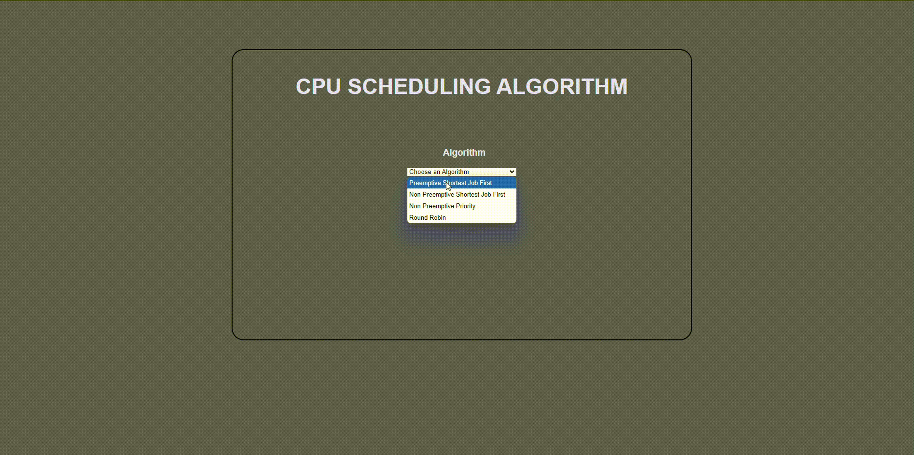

# CPU Scheduling Algorithm

This project implements various CPU scheduling algorithms including Shortest Job First (SJF), Preemptive Shortest Job First (PSJF), Priority Scheduling (P), and Round Robin (RR). The project is built using Vue.js and allows users to input arrival times, burst times, and other relevant parameters to visualize the scheduling process.

## Project Preview


## Project Setup

### Install Dependencies
To install the necessary dependencies, run:
```bash
npm install
```

### Compiles and Hot-Reloads for Development
To start the development server with hot-reloading, run:
```bash
npm run serve
```

### Compiles and Minifies for Production
```bash
npm run build
```

## Usage
1. Select Algorithm: Choose the desired CPU scheduling algorithm from the dropdown menu.
2. Input Arrival and Burst Times: Enter the arrival times and burst times for each process.
3. Input Quantum Time: If using the Round Robin algorithm, enter the quantum time.
4. Input Priority: If using the Priority Scheduling algorithm, enter the priority for each process.
5. Run the Algorithm: Click the button to run the selected algorithm and visualize the scheduling process.

## Algorithms Implemented

### Shortest Job First (SJF)
The SJF algorithm selects the process with the smallest burst time from the ready queue. It is a non-preemptive algorithm.

### Preemptive Shortest Job First (PSJF)
The PSJF algorithm selects the process with the smallest remaining burst time from the ready queue. It is a preemptive algorithm.

### Priority Scheduling (P)
The Priority Scheduling algorithm selects the process with the highest priority from the ready queue. It can be either preemptive or non-preemptive.

### Round Robin (RR)
The Round Robin algorithm assigns a fixed time quantum to each process in the ready queue. It is a preemptive algorithm.

## File Structure
`src/algorithms/SJF.js`: Implementation of the Shortest Job First algorithm. <br>
`src/algorithms/PSJF.js`: Implementation of the Preemptive Shortest Job First algorithm.<br>
`src/algorithms/P.js`: Implementation of the Priority Scheduling algorithm.<br>
`src/algorithms/RR.js`: Implementation of the Round Robin algorithm.<br>
`src/components/`: Vue components for the project.<br>
`src/App.vue`: Main Vue component that integrates all the algorithms and components.<br>
